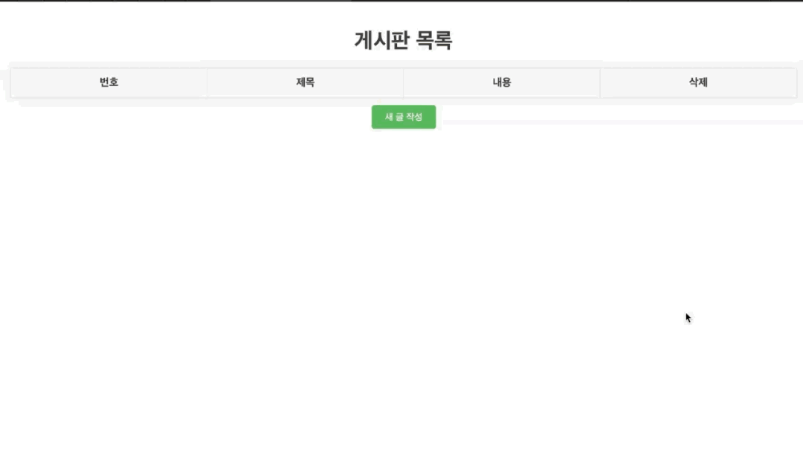

# Spring Boot 게시판 프로젝트.

이 프로젝트는 **Spring Boot**를 이용해 간단한 **게시판 웹 애플리케이션**을 구현한 예제입니다. 사용자는 게시글을 **작성**, **조회**, **삭제**할 수 있으며, **H2 데이터베이스**에 데이터를 저장합니다.

## 🛠️ 주요 기능
- 📄 게시글 목록 조회
- ✍️ 게시글 작성
- 🗑️ 게시글 삭제
- 🗃️ H2 데이터베이스 사용
- 🎨 **Thymeleaf** 템플릿 엔진을 사용한 UI 구현

## ⚙️ 기술 스택
- **Java 17**
- **Spring Boot 3.3.4**
- **Spring Data JPA**
- **Thymeleaf**
- **H2 Database**

## 📂 프로젝트 구조

```bash
├── src
│   ├── main
│   │   ├── java
│   │   │   └── com.example.myboard
│   │   │       ├── controller
│   │   │       └── domain
│   │   │       └── repository
│   │   └── resources
│   │       ├── templates
│   │       │   └── board
│   │       │       ├── createForm.html
│   │       │       ├── list.html
│   │       └── application.properties
├── pom.xml
└── README.md
```

## 실행 화면

